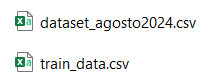

# Falta Carpeta **data**
Por cuestiones de espacio, no fue posible subir la carpeta data a GitHub. Esta carpeta contiene los conjuntos de datos necesarios para el proyecto, los cuales se pueden descargar desde el siguiente enlace: https://drive.google.com/drive/folders/1YjYSmZmyGIyXYJfoVDy-FNB-NJFPGtFo, los cuales son:
- **dataset_agosto2024.csv**
- **train_data.csv**.

 Debe verse así:

# Falta Carpeta **salidas_intermedias**
Debido a limitaciones de espacio, no fue posible subir la carpeta salidas_intermedias a GitHub. Esta carpeta contiene todas las noticias del archivo **dataset_agosto2024.csv** clasificadas mediante el modelo de inteligencia artificial.

A continuación se muestra cómo debería verse la estructura de la carpeta una vez que se haya ejecutado el cuadernillo (inicialmente la carpeta debe estar vacía):

